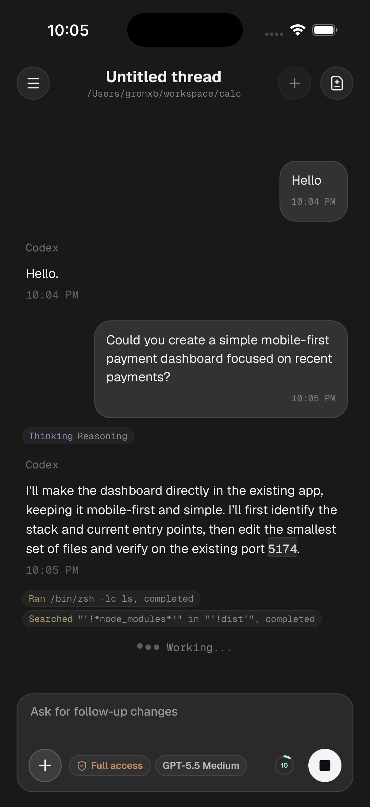
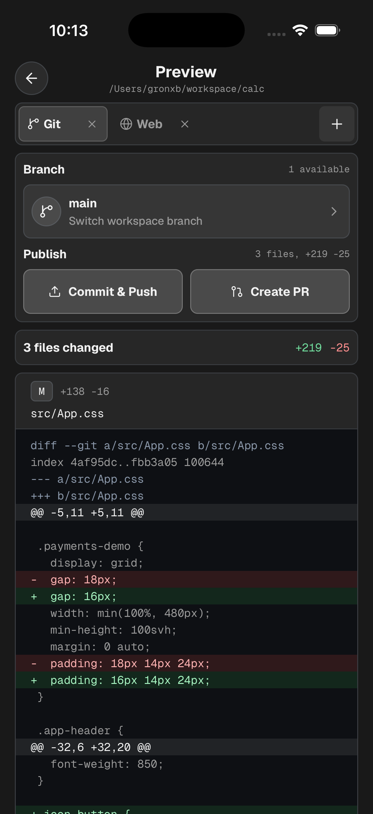
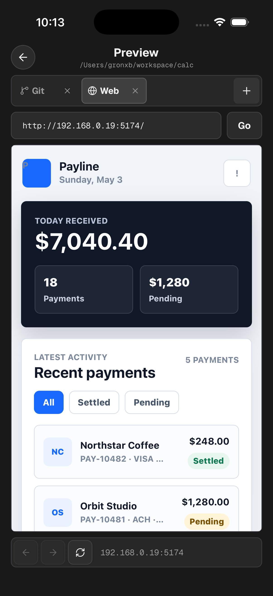
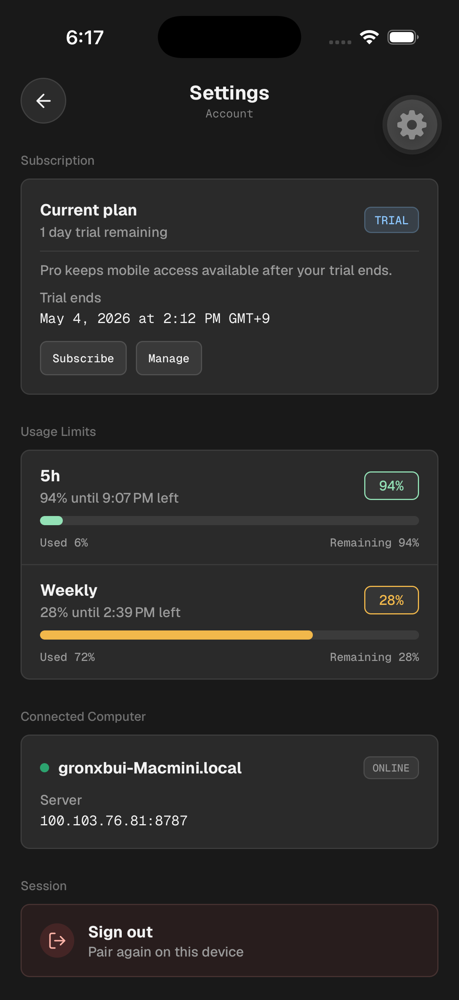

# Codex Relay（自建版）

<p align="center">
  
</p>

<p align="center">
  <strong>用手机遥控电脑上的 Codex，真正的活还是在你电脑上干。</strong>
</p>

<p align="center">
  
  
  
  
  
</p>

Codex Relay 是一个「本地优先」的 Codex 移动端配套方案：在本机工作区跑一个
Relay 服务，手机通过局域网（或公网）与它配对，就能随时跟进、继续、打断
电脑上的 Codex 会话。

> 本仓库是**自建 / 开发版 monorepo**：除了核心 Relay 服务端，还包含 iOS 移动端、
> HarmonyOS 客户端、网页版与桌面版控制面板。它是独立项目，与 OpenAI 及其
> Codex 团队没有任何关联、背书或赞助关系。

<p align="center">
  
</p>

<p align="center">
  
  
  
  
</p>

## 核心能力

- 把本机工作区的 Codex 输出流式推送到已配对的手机端。
- 手机端可发起提示词、继续线程，并在 Codex 需要输入时作出响应。
- 可启动并接管本机 Codex 桌面端会话（macOS），也能继续现有 CLI 会话。
- 可在设置中切换 CLI 会话与 Codex 桌面端会话，避免两套会话混在一起。
- 查看活动线程、排队输入、审批请求与工作区状态。
- 手机端预览 git 变更、本地 Web 输出、文件与终端界面。
- 分开的「回合完成」与「需要操作」两类推送通知。
- 配对与会话数据只保存在本地 Relay 状态里，不经过第三方。

## 仓库结构

本仓库是 pnpm monorepo，根工作区包含 `apps/*` 与 `packages/*`：

| 路径 | 说明 |
| --- | --- |
| `packages/codex-relay` | 核心 Relay 服务端（Hono）。CLI + HTTP 服务 + 配对/会话管理，含 Vitest 测试。开发态默认监听 `8787` |
| `packages/react-native-direct-fetch` | React Native 侧直连 Relay 的辅助库 |
| `apps/mobile` | iOS 移动端（Expo + React Native + expo-router），用 dev-client 开发 |
| `apps/hm_codex` | HarmonyOS 客户端（本机独立维护，暂未随仓库公开） |
| `tools/relay-panel` | 网页版控制面板：一键启停 Relay、配对二维码、批准配对、看日志 |
| `tools/relay-panel-desktop` | Electron 桌面版控制面板：把「面板 + Relay 服务器」打包成可双击运行的 App |

## 快速开始（开发模式）

### 前置要求

- Node.js 22.14+、pnpm 11+
- Codex CLI 已安装并登录
- iOS 端：macOS + Xcode（跑模拟器 / 真机）
- HarmonyOS 端：DevEco Studio（构建 `apps/hm_codex` 子模块）
- 手机与电脑之间有一条可达的网络路径（同 Wi-Fi 或 Tailscale）

### 1. 安装依赖

```sh
pnpm install
```

### 2. 启动 Relay 服务端

```sh
pnpm dev
```

等价于 `pnpm dev:server`（`tsx watch` 开发态，默认监听 `8787`）。服务端会打印
配对二维码、手机 URL 与 `codex-relay://pair...` 配对链接。

### 3. 启动控制面板

```sh
pnpm panel
```

浏览器打开 **http://127.0.0.1:7800** 即可管理 Relay（详见下文「控制面板」）。

### 4. 运行移动端

iOS（真机 / 模拟器）：

```sh
pnpm dev:mobile:ios
```

HarmonyOS：用 DevEco Studio 打开本机独立维护的 `apps/hm_codex` 工程，构建安装到设备。

### 5. 配对

手机端扫描服务端 / 面板打印的二维码；扫不了就把 `codex-relay://pair...` 链接
粘贴进 App。手机出现 `XXXX-XXXX` 审批码后，在本机批准：

```sh
pnpm codex-relay:cli approve XXXX-XXXX
```

或直接在控制面板里输入配对码批准。

## 控制面板

### 网页版（`tools/relay-panel`）

```sh
pnpm panel
```

浏览器打开 http://127.0.0.1:7800：

- 一键启动 / 停止 `17878` 端口的 Relay 服务
- 显示配对二维码（默认本地 / 局域网；配置 `PUBLIC_URL` 后展示公网配对码）
- 输入 `XXXX-XXXX` 配对码批准设备
- 查看服务日志

端口可用环境变量调整：`PANEL_PORT`（默认 `7800`）、`RELAY_PORT`（默认 `17878`）。
二维码使用仓库内置的 `qrcode.min.js`，**完全离线可用**。

### 桌面版（`tools/relay-panel-desktop`）

Electron 应用，把「控制面板 + Relay 服务器」打包在一起：双击即可运行，
无需开终端、无需装 Node / pnpm，自带完整 Relay 服务器（构建产物 + 运行时依赖 +
native 模块）。

```sh
cd tools/relay-panel-desktop
npm install
npm run build:mac   # 生成 dist/ 下的 DMG（Windows 用 build:win，需在 Windows 上构建）
```

桌面版详细说明见
[tools/relay-panel-desktop/README.md](./tools/relay-panel-desktop/README.md)。

## 常用命令

| 命令 | 作用 |
| --- | --- |
| `pnpm dev` / `pnpm dev:server` | 启动 Relay 服务端（`tsx watch`，8787） |
| `pnpm panel` | 启动网页版控制面板（7800） |
| `pnpm panel:desktop` | Electron 开发模式运行桌面版 |
| `pnpm panel:desktop:build` | 构建桌面版 macOS 安装包 |
| `pnpm panel:desktop:build:win` | 在 Windows 上构建桌面版 Windows 安装包 |
| `pnpm dev:mobile` | 启动 Expo Metro（dev-client） |
| `pnpm dev:mobile:ios` | 构建并运行 iOS dev-client |
| `pnpm dev:mobile:android` | 构建并运行 Android dev-client |
| `pnpm codex-relay:cli` | 直接跑 relay CLI（开发态） |
| `pnpm test` | 跑服务端 Vitest 套件 |
| `pnpm typecheck` | 全仓 `tsc --noEmit` |
| `pnpm lint` / `pnpm lint:fix` | oxlint + oxfmt 检查 / 自动修复 |
| `pnpm format` | oxfmt 全仓格式化 |

## 配置与环境变量

### Codex 桌面端控制（默认 IPC）

Relay 默认通过 Codex 桌面端本地的 `~/.codex/ipc/ipc.sock` 控制会话，不依赖 CDP：

- 发送消息走 `thread-follower-start-turn`，新建会话用 `codex://threads/new` 深链加 `session_index` 读取新 ID。
- 停止、模型/推理档位、继续输入、steer 优先走桌面 IPC，失败才回退 macOS 自动化。
- 模型列表、继续会话、归档、置顶、重命名也会同步回桌面会话和本地列表状态。
- 桌面 IPC 完成时会触发移动端推送通知。
- 只有显式设置 `CODEX_DESKTOP_USE_CDP=1` 或 `CODEX_DESKTOP_LAUNCH_MODE=cdp` 时，才使用仓库内置的 `tools/Codex CDP.app` 启动带本地调试接口的桌面端。

### 环境变量

Relay 服务端默认监听 `0.0.0.0:8787`：

| 变量 | 作用 | 默认 |
| --- | --- | --- |
| `PORT` | Relay 服务端口 | `8787` |
| `HOST` | 监听地址 | `0.0.0.0` |
| `CODEX_RELAY_WORKSPACE_PATH` | Codex 使用的工作区路径 | 当前目录 |
| `CODEX_RELAY_AUTH_DB_PATH` | 配对与会话数据库路径 | — |
| `CODEX_RELAY_APP_SERVER_MODE` | `socket` 共享终端/移动端会话 | `stdio` |
| `CODEX_BIN` | Codex CLI 可执行文件路径 | — |
| `CODEX_DESKTOP_BIN` | Codex 桌面端可执行文件路径，缺省优先使用 ChatGPT.app 内置二进制 | — |
| `CODEX_DESKTOP_APP_PATH` | Codex/ChatGPT 桌面 App 路径，用于官方 Remote Control 设备密钥 | `/Applications/ChatGPT.app` |
| `CODEX_DESKTOP_CDP_PORT` | 本地 Codex Desktop CDP 调试端口 | `39252` |
| `CODEX_DESKTOP_USE_CDP` | 设为 `1` 时启用 CDP 启动/回退路径 | 空 |
| `CODEX_DESKTOP_LAUNCH_MODE` | 设为 `cdp` 时使用 Codex CDP 启动器 | 空 |
| `CODEX_DESKTOP_BUNDLE_ID` | Codex 桌面 App Bundle ID | `com.openai.codex` |
| `CODEX_DESKTOP_CDP_LAUNCHER_APP` | Codex CDP 启动器 App 路径 | `tools/Codex CDP.app` |
| `CODEX_HOME` | 读取本地会话元数据的 Codex 家目录 | — |
| `EXPO_PUBLIC_CODEX_RELAY_SERVER_URL` | 移动端连接 Relay 的地址（真机用 `http://<局域网IP>:8787`） | `http://127.0.0.1:8787` |

控制面板：

| 变量 | 作用 | 默认 |
| --- | --- | --- |
| `PANEL_PORT` | 面板端口 | `7800` |
| `RELAY_PORT` | 面板管理的 Relay 端口 | `17878` |
| `PUBLIC_URL` | 设置后生成公网配对码（如 `http://host:8789`），默认不写死 | 空 |

后台运行时，运行时文件（日志、进程状态、配对数据）写在当前工作区的
`.codex-relay/` 下。

## 测试与质量

```sh
pnpm test          # 服务端 Vitest
pnpm typecheck     # 全仓类型检查
pnpm lint          # oxlint + oxfmt 检查
pnpm lint:fix      # 自动修复并格式化
```

服务端测试位于 `packages/codex-relay/test`，改动 API、校验、流式、线程状态时
建议补上对应覆盖。

## 架构速览

```
手机端（iOS / HarmonyOS）
      │  配对码 / 会话 / 流式输出
      ▼
Relay 服务端（packages/codex-relay, Hono）
      │  启动 Codex CLI app-server
      ▼
本机 Codex CLI / 工作区（git、shell、文件）
```

控制面板（网页 / 桌面）则是面向本机的运维入口：启停 Relay、展示配对二维码、
批准设备、查看日志。

## 贡献

- 提交信息与 PR 描述使用中文或英文均可，保持简洁（沿用仓库现有惯例）。
- 对服务端 API、流式、线程状态的改动，请补测试并跑 `pnpm test`、
  `pnpm typecheck`、`pnpm lint`。
- 移动端改动以类型检查 + dev-client / 真机验证为主，PR 里注明验证方式。
- 涉及移动端 UI 的改动，尽量附上模拟器 / 真机截图或录屏。

## License

Codex Relay 采用 Apache License 2.0，见 [LICENSE](./LICENSE)。

Codex Relay 名称、Logo、应用图标、截图等品牌资产不在 Apache-2.0 许可范围内，
见 [TRADEMARKS.md](./TRADEMARKS.md)。
